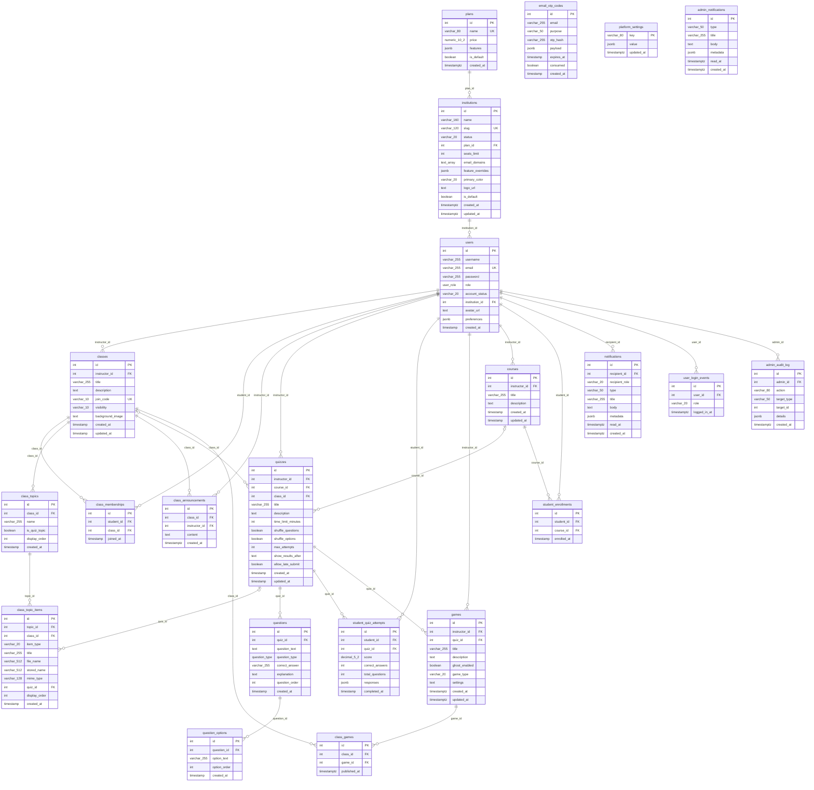

# Database Diagram — EduAIGames PostgreSQL Schema

This document accompanies `08-database-diagram.drawio` and describes the **22-table** PostgreSQL schema used by EduAIGames (database name: `fyp`).

## Table inventory (22 tables)

| # | Table | Domain | FK parent(s) |
|---|---|---|---|
| 1 | `plans` | Tenancy | — |
| 2 | `institutions` | Tenancy | `plans` |
| 3 | `users` | Auth / users | `institutions` |
| 4 | `email_otp_codes` | Auth | *(none — pre-registration)* |
| 5 | `user_login_events` | Analytics | `users` |
| 6 | `classes` | Classes | `users` (instructor) |
| 7 | `class_memberships` | Classes | `users`, `classes` |
| 8 | `class_topics` | Class content | `classes` |
| 9 | `class_topic_items` | Class content | `class_topics`, `classes`, `quizzes` |
| 10 | `class_announcements` | Class content | `classes`, `users` |
| 11 | `quizzes` | Assessment | `users`, `classes`, `courses` |
| 12 | `questions` | Assessment | `quizzes` |
| 13 | `question_options` | Assessment | `questions` |
| 14 | `student_quiz_attempts` | Assessment | `users`, `quizzes` |
| 15 | `games` | Gamification | `users`, `quizzes` |
| 16 | `class_games` | Gamification | `classes`, `games` |
| 17 | `courses` | Legacy courses | `users` |
| 18 | `student_enrollments` | Legacy courses | `users`, `courses` |
| 19 | `notifications` | Messaging | `users` |
| 20 | `admin_audit_log` | Admin | `users` (nullable, SET NULL) |
| 21 | `platform_settings` | Admin | *(standalone key-value)* |
| 22 | `admin_notifications` | Admin | *(standalone broadcast)* |

---

## Conceptual Entity Relationship Diagram

Render at [mermaid.live](https://mermaid.live):

```mermaid
erDiagram
    PLAN ||--o{ INSTITUTION : "plan_id"
    INSTITUTION ||--o{ USER : "institution_id"

    USER ||--o{ CLASS : "instructor_id"
    USER ||--o{ CLASS_MEMBERSHIP : "student_id"
    CLASS ||--o{ CLASS_MEMBERSHIP : "class_id"

    CLASS ||--o{ CLASS_TOPIC : "class_id"
    CLASS_TOPIC ||--o{ CLASS_TOPIC_ITEM : "topic_id"
    CLASS_TOPIC_ITEM }o--o| QUIZ : "quiz_id"

    USER ||--o{ QUIZ : "instructor_id"
    CLASS |o--o{ QUIZ : "class_id"
    QUIZ ||--o{ QUESTION : "quiz_id"
    QUESTION ||--o{ QUESTION_OPTION : "question_id"

    USER ||--o{ QUIZ_ATTEMPT : "student_id"
    QUIZ ||--o{ QUIZ_ATTEMPT : "quiz_id"

    USER ||--o{ GAME : "instructor_id"
    QUIZ ||--o{ GAME : "quiz_id"
    CLASS ||--o{ CLASS_GAME : "class_id"
    GAME ||--o{ CLASS_GAME : "game_id"

    CLASS ||--o{ ANNOUNCEMENT : "class_id"
    USER ||--o{ ANNOUNCEMENT : "instructor_id"

    USER ||--o{ COURSE : "instructor_id"
    COURSE ||--o{ ENROLLMENT : "course_id"
    USER ||--o{ ENROLLMENT : "student_id"

    USER ||--o{ NOTIFICATION : "recipient_id"
    USER ||--o{ LOGIN_EVENT : "user_id"
    USER ||--o{ AUDIT_LOG : "admin_id"
```

---

## Physical Database Diagram (all columns)



---

## Key constraints

| Constraint | Tables |
|---|---|
| `UNIQUE(email)` | `users` |
| `UNIQUE(join_code)` | `classes` |
| `UNIQUE(student_id, class_id)` | `class_memberships` |
| `UNIQUE(student_id, course_id)` | `student_enrollments` |
| `UNIQUE(class_id, game_id)` | `class_games` |
| `CHECK(visibility IN ('public','private'))` | `classes` |
| `CHECK(item_type IN ('file','quiz'))` | `class_topic_items` |
| `CHECK(char_length(content) <= 500)` | `class_announcements` |

## Delete rules

| Relationship | ON DELETE |
|---|---|
| Most child → parent FKs | `CASCADE` |
| `quizzes.class_id` → `classes` | `SET NULL` |
| `quizzes.course_id` → `courses` | `SET NULL` |
| `admin_audit_log.admin_id` → `users` | `SET NULL` |

## Schema sources

- `server/src/setupDatabase.ts` — core tables
- `server/src/gameQueries.ts` — `games`, `class_games`
- `server/src/institutionServices.ts` — `plans`, `institutions`
- `server/src/notificationQueries.ts` — `notifications`
- `server/src/loginEvents.ts` — `user_login_events`
- `server/src/adminInfrastructure.ts` — `admin_audit_log`, `platform_settings`, `admin_notifications`
- `server/src/index.ts` — profile columns, quiz settings, `class_announcements`

## How to open the draw.io diagram

Open `08-database-diagram.drawio` in [app.diagrams.net](https://app.diagrams.net) or VS Code with the Draw.io Integration extension. Export at 200–300 % zoom for thesis print quality.
